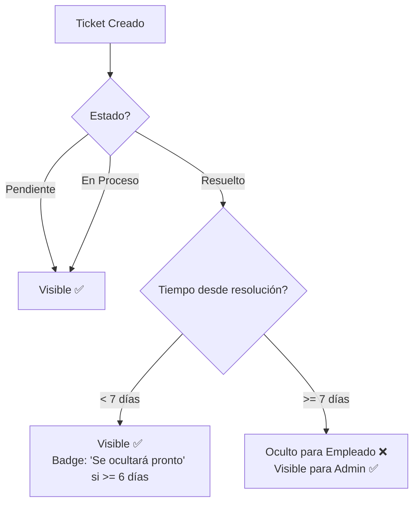

# 🗑️ Sistema de Auto-Ocultación de Tickets

## Descripción General

Los tickets resueltos se ocultan automáticamente de la vista del usuario después de **1 semana** para mantener la lista limpia y organizada, sin eliminar datos del sistema.

---

## 🎯 Funcionalidad

### Condiciones para Ocultar un Ticket

Un ticket se oculta automáticamente cuando cumple **AMBAS** condiciones:

1. ✅ **Estado:** `RESUELTO` (2)
2. ✅ **Tiempo:** Más de **7 días** desde la última actualización (`updated_at`)

### Comportamiento por Rol

#### 👤 **Empleados** (Usuarios Regulares)
- ✅ **VEN:** Tickets pendientes, en proceso, y resueltos con menos de 7 días
- ❌ **NO VEN:** Tickets resueltos con más de 7 días
- 📊 **Estadísticas:** Solo cuentan tickets visibles

#### 👨‍💼 **Administradores**
- ✅ **VEN:** **TODOS** los tickets sin excepción
- 📊 **Estadísticas:** Cuentan todos los tickets del sistema
- 🔍 **Pueden filtrar:** Por cualquier estado incluyendo resueltos antiguos

---

## 🔧 Implementación Técnica

### 1. Scope en Modelo Ticket

```php
// app/Models/Ticket.php

/**
 * Scope para tickets visibles (excluye resueltos con más de 1 semana)
 */
public function scopeVisiblesParaUsuario(Builder $query): Builder
{
    return $query->where(function($q) {
        // Incluir todos los tickets NO resueltos
        $q->where('estado', '!=', EstadoTicket::RESUELTO->value)
          // O incluir resueltos con menos de 1 semana
          ->orWhere(function($subQuery) {
              $subQuery->where('estado', EstadoTicket::RESUELTO->value)
                       ->where('updated_at', '>=', now()->subWeek());
          });
    });
}

/**
 * Verificar si el ticket debe ocultarse automáticamente
 */
public function debeOcultarse(): bool
{
    return $this->estado === EstadoTicket::RESUELTO->value 
        && $this->updated_at->lt(now()->subWeek());
}
```

### 2. Aplicación en Repository

```php
// app/Repositories/TicketRepository.php

public function getByUser(int $userId): Collection
{
    return Ticket::forUser($userId)
        ->visiblesParaUsuario() // 👈 Filtro de visibilidad
        ->withBasicRelations()
        ->recent()
        ->get();
}

public function getStats(?int $userId = null): array
{
    $baseQuery = Ticket::query();

    if ($userId) {
        $baseQuery->forUser($userId)->visiblesParaUsuario(); // 👈 Filtro
    }

    return [
        'total' => (clone $baseQuery)->count(),
        'pendientes' => (clone $baseQuery)->pendientes()->count(),
        'en_proceso' => (clone $baseQuery)->enProceso()->count(),
        'resueltos' => (clone $baseQuery)->resueltos()->count(),
    ];
}
```

### 3. Indicador Visual en UI

```blade
<!-- resources/views/livewire/tickets/my-tickets.blade.php -->

<!-- Aviso de próxima ocultación (6+ días resuelto) -->
@if($ticket->estado->value === 2 && $ticket->updated_at->diffInDays(now()) >= 6)
    <span class="px-2 py-1 text-xs bg-orange-50 text-orange-700 rounded border border-orange-200">
        Se ocultará pronto
    </span>
@endif
```

### 4. Banner Informativo

```blade
<!-- Info: Auto-ocultación de tickets resueltos -->
<div class="mb-6 bg-blue-50 border border-blue-200 rounded-lg p-4">
    <div class="flex items-start">
        <svg class="..."></svg>
        <div>
            <h3 class="text-sm font-medium text-blue-900 mb-1">Auto-archivo de tickets</h3>
            <p class="text-sm text-blue-700">
                Los tickets resueltos se ocultarán automáticamente después de 
                <strong>1 semana</strong> para mantener tu lista organizada. 
                No se eliminan, solo dejan de mostrarse.
            </p>
        </div>
    </div>
</div>
```

---

## 📊 Flujo de Ocultación



---

## 🕒 Timeline de un Ticket

| Día | Estado | Visible Empleado | Visible Admin | UI |
|-----|--------|------------------|---------------|-----|
| 0 | Pendiente | ✅ | ✅ | - |
| 2 | En Proceso | ✅ | ✅ | - |
| 5 | **Resuelto** | ✅ | ✅ | - |
| 6 | Resuelto | ✅ | ✅ | - |
| 7 | Resuelto | ✅ | ✅ | - |
| 8 | Resuelto | ✅ | ✅ | - |
| 9 | Resuelto | ✅ | ✅ | - |
| 10 | Resuelto | ✅ | ✅ | - |
| 11 | Resuelto | ✅ | ✅ | 🟠 "Se ocultará pronto" |
| **12** | **Resuelto** | **❌ OCULTO** | ✅ | - |
| 13+ | Resuelto | ❌ | ✅ | - |

---

## 🎨 Indicadores Visuales

### Badge de Advertencia (6+ días)
- **Cuándo:** Ticket resuelto hace 6 o más días
- **Color:** Naranja (`bg-orange-50 text-orange-700`)
- **Texto:** "Se ocultará pronto"
- **Propósito:** Avisar al usuario que el ticket desaparecerá en 1-2 días

### Banner Informativo
- **Ubicación:** Arriba de la lista de tickets
- **Color:** Azul informativo (`bg-blue-50`)
- **Texto:** Explica la funcionalidad de auto-archivo
- **Siempre visible:** Para que los usuarios sepan qué esperar

---

## 💡 Ventajas del Sistema

### ✅ Pros
- **Lista limpia:** Solo tickets relevantes visibles
- **Sin eliminación de datos:** Información preservada
- **Automático:** No requiere intervención manual
- **Transparente:** Los usuarios son informados
- **Configurable:** Fácil cambiar el período de 7 días

### 📋 Casos de Uso

1. **Usuario reporta problema**
   - Ticket creado → Visible

2. **Admin resuelve el problema**
   - Ticket → Resuelto → Visible por 7 días más

3. **Pasan 6 días**
   - Aparece badge "Se ocultará pronto"
   - Usuario tiene 1 día para ver detalles finales

4. **Pasan 7 días**
   - Ticket desaparece de la vista del empleado
   - Ticket sigue visible para administradores
   - Datos preservados en BD para auditoría

---

## 🔧 Configuración

### Cambiar el Período de Ocultación

Para cambiar de 7 días a otro período, modificar en 2 lugares:

#### 1. Scope del Modelo
```php
// app/Models/Ticket.php

public function scopeVisiblesParaUsuario(Builder $query): Builder
{
    return $query->where(function($q) {
        $q->where('estado', '!=', EstadoTicket::RESUELTO->value)
          ->orWhere(function($subQuery) {
              $subQuery->where('estado', EstadoTicket::RESUELTO->value)
                       ->where('updated_at', '>=', now()->subDays(14)); // 👈 Cambiar aquí
          });
    });
}
```

#### 2. Método debeOcultarse
```php
public function debeOcultarse(): bool
{
    return $this->estado === EstadoTicket::RESUELTO->value 
        && $this->updated_at->lt(now()->subDays(14)); // 👈 Cambiar aquí
}
```

#### 3. Badge de Advertencia en Vista
```blade
@if($ticket->estado->value === 2 && $ticket->updated_at->diffInDays(now()) >= 13)
    <!-- Mostrar 1 día antes (14 - 1 = 13) -->
@endif
```

---

## 🧪 Testing

### Casos de Prueba

#### Test 1: Ticket Recién Resuelto
```php
// Crear ticket resuelto hace 1 día
$ticket = Ticket::factory()->resuelto()->create([
    'updated_at' => now()->subDay(),
]);

// Debe ser visible
$visible = Ticket::visiblesParaUsuario()->find($ticket->id);
$this->assertNotNull($visible);
```

#### Test 2: Ticket Resuelto hace 7 días
```php
// Crear ticket resuelto hace exactamente 7 días
$ticket = Ticket::factory()->resuelto()->create([
    'updated_at' => now()->subWeek(),
]);

// Debe ser visible (límite inclusivo)
$visible = Ticket::visiblesParaUsuario()->find($ticket->id);
$this->assertNotNull($visible);
```

#### Test 3: Ticket Resuelto hace 8 días
```php
// Crear ticket resuelto hace 8 días
$ticket = Ticket::factory()->resuelto()->create([
    'updated_at' => now()->subWeek()->subDay(),
]);

// NO debe ser visible
$visible = Ticket::visiblesParaUsuario()->find($ticket->id);
$this->assertNull($visible);
```

#### Test 4: Método debeOcultarse()
```php
$ticketReciente = Ticket::factory()->resuelto()->create([
    'updated_at' => now()->subDays(5),
]);

$ticketAntiguo = Ticket::factory()->resuelto()->create([
    'updated_at' => now()->subDays(10),
]);

$this->assertFalse($ticketReciente->debeOcultarse());
$this->assertTrue($ticketAntiguo->debeOcultarse());
```

---

## 🚀 Mejoras Futuras

### Posibles Extensiones

1. **Configuración por Usuario**
   - Permitir que cada usuario configure su período de ocultación
   - Default: 7 días, rango: 3-30 días

2. **Papelera de Tickets**
   - Vista separada de "Tickets archivados"
   - Botón para "Restaurar" temporalmente

3. **Notificación antes de Ocultar**
   - Email 1 día antes de ocultar
   - "Tu ticket #123 se ocultará mañana"

4. **Dashboard de Tickets Ocultos (Admin)**
   - Filtro especial para ver todos los ocultos
   - Estadísticas de tickets archivados

5. **Soft Delete Real**
   - Implementar `deleted_at` para eliminación suave
   - Combinar con ocultación automática

---

## 📝 Notas Importantes

⚠️ **Importante:** La ocultación se basa en `updated_at`, no en `created_at`. Esto significa:
- Si un ticket se resuelve el día 1, la cuenta de 7 días empieza desde el día 1
- Si se reabre y vuelve a resolver, la cuenta se reinicia
- Cada cambio de estado actualiza `updated_at`

💡 **Tip:** Para testing rápido, puedes cambiar temporalmente `subWeek()` por `subMinutes(10)` y ver la ocultación en tiempo real.

🔒 **Seguridad:** Los administradores SIEMPRE ven todos los tickets. El scope `visiblesParaUsuario()` solo se aplica en consultas de empleados.

---

**Última actualización:** 27 de enero de 2026  
**Versión:** 1.0  
**Estado:** ✅ Implementado y funcional
